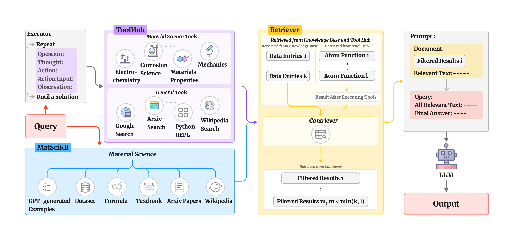

# NLP4MatSci-HoneyComb



# Project Setup

## 1. Virtual Environment and Required Packages

Set up a virtual environment and install the necessary packages:

```shell
virtualenv /path/to/env
source /path/to/env/bin/activate
pip install -r requirements.txt
```

## 2. Environment Variables

Before proceeding, ensure you have the following:

- **OPENAI API Key:** Obtain from [OpenAI](https://openai.com).
- **Serper API Key:** Register at [Serper](https://serper.dev) for Google Search functionality.
- **Serp API Key:** Register at [SerpAPI](https://serpapi.com) for Google Scholar Search functionality.
- **Repository Path:** Identify the local path to this repository for setting the `SAVING_DIRECTORY` variable.

Set the environment variables:

```shell
export SAVING_DIRECTORY=/path/to/Model_Training
export HF_HOME=$SAVING_DIRECTORY/contriever_framework/.cache/huggingface
export OPENAI_API_KEY=your_openai_api_key
export SERPER_API_KEY=your_serper_api_key
export SERP_API_KEY=your_serp_api_key
```

## 3. Download Model Files from HuggingFace

Ensure the directory structure within `$HF_HOME` is as follows:

```text
HF_HOME
├── HoneyBee7b
├── facebook
│   └── contriever
├── meta-llama
│   ├── Llama-2-7b-chat-hf
│   └── Meta-Llama-3-8B-Instruct
├── peft
└── yahma
    └── llama-7b-hf
```

### Model File Locations:

- **HoneyBee7b:**
  - Download from: [HoneyBee7b](https://huggingface.co/Bang-UdeM-Mila/HoneyBee/tree/main/7b)

- **facebook/contriever:**
  - Download from: [contriever](https://huggingface.co/facebook/contriever/tree/main)

- **meta-llama/Llama-2-7b-chat-hf:**
  - Download from: [Llama-2-7b-chat-hf](https://huggingface.co/meta-llama/Llama-2-7b-chat-hf/tree/main)

- **meta-llama/Meta-Llama-3-8B-Instruct:**
  - Download from: [Meta-Llama-3-8B-Instruct](https://huggingface.co/meta-llama/Meta-Llama-3-8B-Instruct/tree/main)

- **peft:**
  - Download and unzip `peft.zip` from: [NLP4MatSci-HoneyBee](https://github.com/BangLab-UdeM-Mila/NLP4MatSci-HoneyBee/tree/main/peft)

- **yahma/llama-7b-hf:**
  - Download from: [llama-7b-hf](https://huggingface.co/yahma/llama-7b-hf/tree/main)


# Baseline Model Test

Navigate to /baseline_model/generative_model

```shell
python main.py --model llama2-7b --dataset sciq --limit 1
```

Possible model choices are `['gpt-3.5', 'gpt-4', 'llama2-7b', 'llama3-8b', 'honeybee-7b']`

Possible dataset choices are `[sciq, mascqa, matscinlp]`

`limit` limits number of entries in the specified dataset. Pretty handy if you just want to take a quick look of if it is working and how the results will be like. You don't need to specify it if you want to run over the entire dataset

Results are all saved as excel file in the same folder.

# Interact with Honeycomb

You may interact with Honeycomb by directly supplementing a query and a model choice.

Navigate to honeycomb_framework/app/ folder

```shell
python main.py --query "What kind of a reaction occurs when a substance reacts quickly with oxygen?" --model "gpt-3.5"
```

Possible model choices are `['gpt-3.5', 'gpt-4', 'llama2-7b', 'llama3-8b', 'honeybee-7b']`

The results are saved as excel to `honeycomb_framework/output/prediction_output/user_test/`


